import {
  PillSelector,
  PokeDamage,
  PokeItem,
  Pokemon,
  PokeMove,
  SpeedInfo,
  StarterPicker,
  StateContext,
} from '../components';
import {
  antidoteInfo,
  grabPersimBerry,
  grabCarbosFor,
  silphRivalHP,
  adjustEV,
} from './any-helpers';

This guide is an interactive version of [PulseEffect's Any% Squirtle route](https://docs.google.com/document/d/1j4fqPzBkLTsCEeLguL0I5xhiXimfVwhbLYwVpi4uRYA/edit?usp=sharing).

## Before Starting

- Make sure your save file options are:

  

- Mashing A, B, and L simultaneously is the fastest way to mash text.
- Watch this [video](https://youtu.be/IMdiOVMCIKY) on if you are a beginner to this speedrun or want to learn the newest methods in RNG Manipulation (this guide assumes the best stats).
- Download this [RNG Manipulation Program](https://www.speedrun.com/tools/Gen3Predictor1.2c.jar_2ssx4.zip) and set [these options](https://i.imgur.com/GB0YJig.png) if you are just starting out.
  Set [these options](https://i.imgur.com/lP39ReJ.png) instead once you learn the game well enough.
  - To help calculate offset for Flowtimer use [this website](https://plnkr.co/edit/w0hvCuTtvJVC6qRAZhGE?p=preview&preview) starting with Offset 0.
  - If you are on Nintendo DS change the line `$scope.fpses = [59.7275]` to `$scope.fpses = [59.7275, 59.5666]` in `app.js`.
- Pokemon LeafGreen has a version exclusive cut friend (<Pokemon name="Sandshrew" />) if you miss out on one in Route 1. Otherwise the version difference does not matter.
- The first 6 steps on normal grass, 7 steps in Viridian Forest, and 8 Steps in Mt.Moon are a 1% chance to get an encounter. This 1% 6/7/8 rule restarts after every brand new encounter.
- Recommend avoiding 28 Special Attack unless really good stats.

## New Game

- Choosing the boy or girl is preference.
- Give yourself a 1-character name ("A" is fastest).
- Give your rival a 1-character name ("A" is also the fastest).

## Pallet Town

- Check and insert your Trainer ID into the RNG Manipulation Program.
- Walk outside then head north towards the grass have Oak stop you.
- Mash through text until you can pick and manipulate Squirtle.
- Head down and fight your rival.
- Enter your Squirtle IVs:

  <StarterPicker />
   

- ### Rival 1

  - <StateContext>
      {({ starter: { nature, atk } }) => (
        <>
          <Pokemon name="Bulbasaur" />:{' '}
          {nature === 'modest' || atk <= 3 ? (
            <>
              <PokeMove name="Tail Whip" /> x1, <PokeMove name="Tackle" />
            </>
          ) : (
            <PokeMove name="Tackle" />
          )}
          <SpeedInfo range={{ from: 0, to: 13, at: 0 }} />
        </>
      )}
    </StateContext>

    - Reset if Bulbasaur ever outspeeds you.

## Route 1-2

- Grab the <PokeItem name="Potion" /> from mart guy.
- Kill any level 2 or 3 <Pokemon name="Pidgey" /> / <Pokemon name="Rattata" /> along the way.
  - <StateContext>
      {({ starter: { nature, atk } }) =>
        (nature === 'modest' || atk < 21) && (
          <>
            <b>Do not</b> kill a level 3 <Pokemon name="Pidgey" />.
          </>
        )
      }
    </StateContext>
  - <StateContext>
      {({ starter }) =>
        starter.spe == 31 && (
          <>
            Attempt to kill an extra <Pokemon name="Pidgey" /> /{' '}
            <Pokemon name="Rattata" /> on Route 1.
          </>
        )
      }
    </StateContext>
- Grab the <PokeItem name="Parcel" /> at the mart then head back to Oak’s lab.
- Catch <Pokemon name="Pidgey" /> / <Pokemon name="Rattata" /> if you come across them (Tackle once to weaken).
  - Do not try to force an encounter since there are backups later.
- On Route 2 cut through the grass before the Viridian Forest entrance (2nd tile to the right) it is 1% to get an encounter.

## Viridian Forest

- Avoid all non mandatory trainers.
- Grab the <PokeItem name="Antidote" /> near the sign above the 2nd Bug Catcher.
- Grab this hidden <PokeItem name="Potion" /> if necessary.

  

- Let the Bug Catcher walk to you from the middle tile if not grabbing the <PokeItem name="Potion" />.

- ### Bug Catcher Sammy

  - <Pokemon name="Weedle" />: <PokeMove name="Tail Whip" /> x1-2, <PokeMove name="Tackle" /> x4-6

    - Swap <PokeMove name="Tail Whip" /> with <PokeMove name="Tackle" /> turn 1 before using it (Right + Select, A + A).
    - Spam <PokeMove name="Bubble" /> if level 7.
    - <PokeDamage
        name="Poison Sting"
        player={{ name: 'squirtle', level: 6, ev: 0 }}
        enemy={{ name: 'weedle', level: 9, atk: 11 }}
      />
    - **Poison** damage:
      <StateContext>
        {({ starter }) => (
          <b> {starter.hp <= 11 ? '2' : '2 at level 6, 3 at level 7'}</b>
        )}
      </StateContext>

- <StateContext>
    {({ starter }) => {
      const { hp, torrent, heal } = antidoteInfo(starter);
      return (
        <>
          If poisoned, use <PokeItem name="Antidote" /> at <b>{hp} HP</b> after
          the fight.
          <ul>
            <li>
              {torrent ? 'In torrent' : <b>No torrent</b>} for Brock's{' '}
              <Pokemon name="Geodude" />.
            </li>
            {heal && (
              <li>
                <b>Need to heal</b> at <Pokemon name="Onix" />.
              </li>
            )}
          </ul>
        </>
      );
    }}
  </StateContext>

## Pewter City

- Head straight to the gym.

- ### Camper Liam

  - <Pokemon name="Geodude" />: <PokeMove name="Bubble" torrent={true} /> (x2)
  - <Pokemon name="Sandshrew" />: <PokeMove name="Bubble" torrent={true} /> x2-4

    - <PokeDamage
        name="Scratch"
        player={{ name: 'squirtle', level: 9, ev: 1 }}
        enemy={{ name: 'sandshrew', level: 11, atk: 21 }}
      />

- ### Leader Brock

  - <Pokemon name="Geodude" />: <PokeMove name="Bubble" torrent={true} /> (x2)

    - 87.5% (14/16) to OHKO at level 11
    - Consider <PokeMove name="Withdraw" /> Turn 1 if HP is too high for Torrent.
    - <PokeDamage
        name="Tackle"
        player={{ name: 'squirtle', level: 10, ev: 2 }}
        enemy={{ name: 'geodude', level: 12, atk: 24 }}
      />
    - <PokeDamage
        name="Tackle"
        player={{ name: 'squirtle', level: 10, ev: 2, stage: 1 }}
        enemy={{ name: 'geodude', level: 12, atk: 24 }}
      />

  - <Pokemon name="Onix" />: <PokeMove name="Bubble" torrent={true} /> (x2)
    <SpeedInfo range={{ from: 14, to: 23, at: -1 }} />

    - 56.25% (9/16) to OHKO
    - Teach <PokeMove name="Water Gun" /> over <PokeMove name="Tail Whip" /> (Mash A)
    - <StateContext>
        {({ starter }) =>
          starter.spe >= 24 && (
            <>
              If you drop speed with <PokeMove name="Bubble" />, it will{' '}
              <PokeMove name="Rock Tomb" /> you at 24+ Speed.{' '}
            </>
          )
        }
      </StateContext>
    - <PokeDamage
        name="Rock Tomb"
        player={{ name: 'squirtle', level: 11, ev: 3 }}
        enemy={{ name: 'geodude', level: 14, atk: 17 }}
      />
    - <PokeDamage
        name="Tackle"
        player={{ name: 'squirtle', level: 11, ev: 3 }}
        enemy={{ name: 'geodude', level: 14, atk: 17 }}
      />
    - <PokeDamage
        name="Rock Tomb"
        player={{ name: 'squirtle', level: 11, ev: 3, stage: 1 }}
        enemy={{ name: 'geodude', level: 14, atk: 17 }}
      />
    - <PokeDamage
        name="Tackle"
        player={{ name: 'squirtle', level: 11, ev: 3, stage: 1 }}
        enemy={{ name: 'geodude', level: 14, atk: 17 }}
      />

- Head straight to the mart and buy
  - 8x <PokeItem name="Potion" /> (↓)
  - 3x <PokeItem name="Antidote" /> (↓)
  - 3x <PokeItem name="Awakening" /> (↓↓)
  - 3x <PokeItem name="Repel" /> (↓↓↓)
  - **If you need <Pokemon name="Paras" /> (FireRed only), then buy a <PokeItem name="Paralyze Heal" /> instead of one <PokeItem name="Potion" />.**
- Head to Route 3 to get your running shoes.

## Route 3

- Attempt to get torrent in as little turns as possible on this route.

  - <StateContext>
      {({ starter }) => (
        <>
          If no torrent for level 14, get it off the 2nd level 10{' '}
          <Pokemon name="Caterpie" /> (
          <b>{starter.hp == 27 ? '+3' : '+2'} HP</b> upon level up).
        </>
      )}
    </StateContext>
  - <StateContext>
      {({ starter: { hp } }) => (
        <>
          If no torrent for level 15, get it off the level 11{' '}
          <Pokemon name="Caterpie" /> (
          <b>{hp == 19 || hp == 26 ? '+3' : hp == 5 ? '+1' : '+2'} HP</b> upon
          level up).
        </>
      )}
    </StateContext>

- ### Bug Catcher Colton

  - <Pokemon name="Caterpie" />: <PokeMove
      name="Water Gun"
      torrent={true}
    /> (x2)

    - <StateContext>
        {({ starter: { spa } }) =>
          spa >= 28 &&
          spa <= 30 &&
          'Both Caterpie are 93.75% (15/16) to OHKO in Torrent'
        }
      </StateContext>

  - <Pokemon name="Weedle" />: <PokeMove name="Water Gun" torrent={true} /> (x2)
  - <Pokemon name="Caterpie" />: <PokeMove
      name="Water Gun"
      torrent={true}
    /> (x2)

- Go above shorts guy and fight the next bug catcher.

- ### Bug Catcher Greg

  - <Pokemon name="Weedle" />: <PokeMove name="Water Gun" torrent={true} />
    <SpeedInfo range={{ from: 14, to: 29, at: -1 }} />
  - <Pokemon name="Caterpie" />: <PokeMove name="Water Gun" /> (x2)
    <SpeedInfo range={{ from: 21, to: 31, at: -1 }} />
  - <Pokemon name="Kakuna" />: <PokeMove name="Water Gun" torrent={true} /> (x2)
  - <Pokemon name="Metapod" />: <PokeMove
      name="Water Gun"
      torrent={true}
    /> (x2)
    <SpeedInfo range={{ from: 21, to: 31, at: -2 }} />

- ### Bug Catcher James

  - <Pokemon name="Caterpie" />: <PokeMove name="Water Gun" /> (x2)
    <SpeedInfo range={{ from: 20, to: 31, at: -1 }} />
  - <Pokemon name="Metapod" />: <PokeMove
      name="Water Gun"
      torrent={true}
    /> (x2)
    <SpeedInfo range={{ from: 27, to: 31, at: -2 }} />

- If you did not catch <Pokemon name="Pidgey" /> on Route 1, catch a <Pokemon name="Spearow" /> / <Pokemon name="Pidgey" />
  now in the grass below the lass (<PokeMove name="Bubble" /> to weaken, <PokeMove name="Tackle" /> if in torrent).

  - If no HM Slaves, can catch <Pokemon name="Nidoran F" /> / <Pokemon name="Nidoran M" /> for <PokeMove name="Cut" /> and <PokeMove name="Strength" />.
  - Can Bag Manip the Lass for a free pass.

- <StateContext>
    {({ starter, frlg }) => (
      <>
        <b>{grabPersimBerry(starter, frlg.mtMoonExp) ? 'Grab' : 'Skip'}</b> the{' '}
        <PokeItem name="Persim Berry" />.
      </>
    )}
  </StateContext>

  - Check optional Mt. Moon trainer selection below.

## Mt. Moon

<PillSelector
  title="Select your optional trainer"
  stateSelector={(store) => store.frlg.mtMoonExp}
  handleSelect={(store, id) => store.frlg.pickMtMoonExp(id)}
  items={[
    { id: 'robby', text: 'Bug Catcher Robby' },
    { id: 'josh', text: 'Youngster Josh' },
    { id: 'spinner', text: 'Rocket Spinner' },
    { id: 'marcos', text: 'Hiker Marcos' },
  ]}
/>

- Run up 8 tiles then
  - Register <PokeItem name="TM Case" />
  - Equip <PokeItem name="Persim Berry" /> from the <PokeItem name="Berry Pouch" /> if you got it.
  - Use <PokeItem name="Repel" />
- Grab this <PokeItem name="Rare Candy" /> near the Bug Catcher (after fighting him if you’re fighting him).
  
- Fight **ONE** of the following optional trainers for EXP depending on the situation

  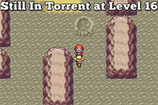
  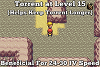

  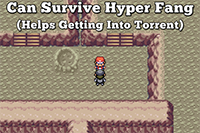
  

  - ### Bug Catcher Robby (if Torrent for level 16)
    - <Pokemon name="Caterpie" />: <PokeMove name="Water Gun" torrent={true} />
    - <Pokemon name="Caterpie" />: <PokeMove name="Water Gun" torrent={true} />
    - <Pokemon name="Metapod" />: <PokeMove name="Water Gun" torrent={true} />
    - <StateContext>
        {({ starter: { hp } }) => (
          <>
            <b>
              {hp == 24 || hp == 25 || hp == 30 || hp == 31 ? '+3' : '+2'} HP
            </b>{' '}
            upon level up.
          </>
        )}
      </StateContext>
  - ### Youngster Josh (if Torrent at level 15 and want to keep torrent)

    - <Pokemon name="Rattata" />: <PokeMove name="Water Gun" torrent={true} />
      <SpeedInfo range={{ from: 16, to: 20, at: 0 }} />

      - <PokeDamage
          name="Quick Attack"
          player={{ name: 'squirtle', level: 15, ev: 10 }}
          enemy={{ name: 'rattata', level: 10, atk: 14 }}
        />

    - <Pokemon name="Rattata" />: <PokeMove name="Water Gun" torrent={true} />

      - <PokeDamage
          name="Quick Attack"
          player={{ name: 'squirtle', level: 15, ev: 10 }}
          enemy={{ name: 'rattata', level: 10, atk: 16 }}
        />

    - <Pokemon name="Zubat" />: <PokeMove
        name="Water Gun"
        torrent={true}
      /> (x2)

      - 62.5% (10/16) to OHKO in torrent

  - ### Rocket Spinner (if you can take a hit from Hyper Fang)

    - <Pokemon name="Rattata" />: <PokeMove
        name="Water Gun"
        torrent={true}
      /> (x2)

      - 62.5% (10/16) to OHKO in torrent
      - <PokeDamage
          name="Hyper Fang"
          player={{ name: 'squirtle', level: 15, ev: 10 }}
          enemy={{ name: 'rattata', level: 13, atk: 19 }}
        />

    - <Pokemon name="Sandshrew" />: <PokeMove name="Water Gun" />

  - ### Hiker Marcos (no Torrent and can not tank Hyper Fang)
    - <Pokemon name="Geodude" />: <PokeMove name="Bubble" />
    - <Pokemon name="Geodude" />: <PokeMove name="Bubble" />
    - <Pokemon name="Onix" />: <PokeMove name="Bubble" />

- Force the Rocket Grunt to walk up to you to save repel steps by running.

- ### Rocket Grunt

  - <Pokemon name="Rattata" />: <PokeMove
      name="Water Gun"
      torrent={true}
    /> (x2)
  - <Pokemon name="Zubat" />: <PokeMove name="Water Gun" torrent={true} /> (x2)

    - Both OHKO in torrent

- ### Super Nerd Miguel

  - <Pokemon name="Grimer" />: <PokeMove name="Water Gun" /> x2

    - If you can survive two turns of Poison and a <PokeMove name="Tackle"/> from <Pokemon name="Voltorb" /> then use <PokeItem name="Antidote" /> on <Pokemon name="Voltorb" />.

  - <Pokemon name="Voltorb" />: <PokeMove
      name="Water Gun"
      torrent={true}
    /> (x2)
    <StateContext>
      {({ frlg }) => (
        <SpeedInfo
          range={
            frlg.mtMoonExp === 'josh'
              ? { from: 24, to: 29, at: 0 }
              : { from: 25, to: 30, at: 0 }
          }
        />
      )}
    </StateContext>

    - 56.25% (9/16) to OHKO in Torrent

  - <Pokemon name="Koffing" />: <PokeMove
      name="Water Gun"
      torrent={true}
    /> (x2)

    - 87.5% (14/16) to OHKO in Torrent
    - If poisoned, <PokeItem name="Antidote" /> immediately if you need a
      <Pokemon name="Rattata" /> / <Pokemon name="Sandshrew" /> / <Pokemon name="Paras" />
      . Otherwise <b>skip</b> and revive with a <PokeItem name="Rare Candy" /> in
      Cerulean City.

- Praise Helix and head outside of Mt. Moon.

## Route 4

- Talk to the Karate Man on the right and teach <PokeMove name="Mega Kick" /> over <PokeMove name="Withdraw" /> (Slot 4).
- If you have no <PokeMove name="Cut" /> slave, catch a <Pokemon name="Sandshrew" /> / <Pokemon name="Rattata" /> in the grass (<PokeMove name="Tackle" /> to weaken).
  - Can teach <PokeMove name="Strength" /> to <Pokemon name="Sandshrew" /> later if caught.
  - If you die using a <PokeItem name="Rare Candy" /> will revive <Pokemon name="Wartortle" />.

## Cerulean City

- Grab this hidden <PokeItem name="Rare Candy" />.

  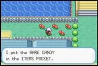

- Open your bag

  - Use 2x <PokeItem name="Potion" />.
  - <PokeItem name="Rare Candy" /> to level 20.
  - Teach <PokeMove name="Bite" /> over <PokeMove name="Bubble" /> (Slot 3).

- Head to the gym.

- Skip both gym trainers and talk to Misty from the right side.

- ### Leader Misty

  - <Pokemon name="Staryu" />: <PokeMove name="Bite" /> x2{' '}

    - <StateContext>
        {({ starter: { spa } }) =>
          spa >= 28 && (
            <>
              {spa >= 30 ? '93%' : '59.4%'} to 2HKO with {spa} SPA
            </>
          )
        }
      </StateContext>

  - <Pokemon name="Starmie" />: <PokeMove name="Bite" />, (<PokeMove name="Tackle" />
    ), <PokeMove name="Bite" />

    - <PokeMove name="Tackle" /> if low roll on the first <PokeMove name="Bite" />

    - <PokeDamage
        name="Swift"
        player={{ name: 'wartortle', level: 20, ev: 11 }}
        enemy={{ name: 'starmie', level: 21, atk: 39 }}
      />

    - <PokeDamage
        name="Water Pulse"
        player={{ name: 'wartortle', level: 20, ev: 0 }}
        enemy={{ name: 'starmie', level: 21, atk: 47 }}
      />

- After the fight:
  - Teach <PokeMove name="Water Pulse" /> over <PokeMove name="Tackle" /> (Slot 2).
  - Heal for Rival so you can survive a <PokeMove name="Quick Attack" /> and <PokeMove name="Vine Whip" />.

## Nugget Bridge

- ### Rival

  - <Pokemon name="Pidgeotto" />: <PokeMove name="Water Pulse" />, <PokeMove name="Bite" />

    - 25% (4/16) to OHKO with <PokeMove name="Water Pulse" /> Torrent
    - <PokeDamage
        name="Quick Attack"
        player={{ name: 'wartortle', level: 21, ev: 13 }}
        enemy={{ name: 'pidgeotto', level: 17, atk: 26 }}
        adjustEV={adjustEV('afterMtMoon')}
      />

  - <StateContext>
      {({ starter: { nature, atk } }) => (
        <>
          <Pokemon name="Bulbasaur" />:{' '}
          {nature === 'modest' && atk <= 12 ? (
            <>
              <PokeMove name="Mega Kick" /> x2
            </>
          ) : (
            <>
              <PokeMove name="Bite" />, <PokeMove name="Mega Kick" />
            </>
          )}
        </>
      )}
    </StateContext>

    - <PokeDamage
        name="Vine Whip"
        player={{ name: 'wartortle', level: 21, ev: 0 }}
        enemy={{ name: 'bulbasaur', level: 18, atk: 30 }}
      />

  - <Pokemon name="Abra" />: <PokeMove name="Water Pulse" />
    <StateContext>
      {({ frlg }) => (
        <SpeedInfo
          range={
            frlg.mtMoonExp === 'josh'
              ? { from: 20, to: 23, at: 0 }
              : { from: 21, to: 24, at: 0 }
          }
        />
      )}
    </StateContext>

    - 81.25% (13/16) to OHKO

  - <Pokemon name="Rattata" />: <PokeMove name="Water Pulse" />

    - <PokeDamage
        name="Quick Attack"
        player={{ name: 'wartortle', level: 22, ev: 13 }}
        enemy={{ name: 'rattata', level: 15, atk: 24 }}
        adjustEV={adjustEV('afterMtMoon')}
      />

- ### Bug Catcher Cale

  - <Pokemon name="Caterpie" />: <PokeMove name="Bite" />
  - <Pokemon name="Weedle" />: <PokeMove name="Bite" />
  - <Pokemon name="Metapod" />: <PokeMove name="Bite" />
  - <Pokemon name="Kakuna" />: <PokeMove name="Bite" />

- ### Lass Ali

  - <Pokemon name="Pidgey" />: <PokeMove name="Bite" />
  - <Pokemon name="Oddish" />: <PokeMove name="Mega Kick" />
  - <Pokemon name="Bellsprout" />: <PokeMove name="Bite" />

- ### Youngster Timmy

  - <Pokemon name="Sandshrew" />: <PokeMove name="Bite" />
  - <Pokemon name="Ekans" />: <PokeMove name="Water Pulse" />
  - Can <PokeMove name="Water Gun" /> everything from here in Torrent

- ### Lass Reli

  - <Pokemon name="Nidoran M" />: <PokeMove
      name="Water Gun"
      torrent={true}
    /> / <PokeMove name="Water Pulse" />
  - <Pokemon name="Nidoran F" />: <PokeMove
      name="Water Gun"
      torrent={true}
    /> / <PokeMove name="Water Pulse" />

- ### Camper Ethan

  - <Pokemon name="Mankey" />: <PokeMove name="Water Gun" torrent={true} /> / <PokeMove name="Water Pulse" />

- ### Rocket Grunt
  - <Pokemon name="Ekans" />: <PokeMove name="Water Gun" torrent={true} /> / <PokeMove name="Water Pulse" />
  - <Pokemon name="Zubat" />: <PokeMove name="Water Gun" torrent={true} /> / <PokeMove name="Water Pulse" />

## Route 25

<PillSelector
  title="Select your trainer"
  stateSelector={(store) => store.frlg.hikerExp}
  handleSelect={(store, id) => store.frlg.pickHikerExp(id)}
  items={[
    { id: 'eric', text: 'Camper Flint' },
    { id: 'nob', text: 'Hiker Nob' },
  ]}
/>

- Go above the Hiker and grab this hidden <PokeItem name="Elixir" />.

  

- ### Hiker Wayne

  - <Pokemon name="Onix" />: <PokeMove name="Water Gun" />

- Yolo the camper spinner and fight the girl below him (1/16 to hit you with proper movement).

- ### Picknicker Kelsey

  - <Pokemon name="Nidoran M" />: <PokeMove name="Water Pulse" />
  - <Pokemon name="Nidoran F" />: <PokeMove name="Water Pulse" />

- If you have Torrent for level 27 and **28+ SPE**, then fight **Hiker Nob** instead of **Camper Flint**.

  - ### Camper Flint

    - <Pokemon name="Rattata" />: <PokeMove name="Water Pulse" />
    - <Pokemon name="Ekans" />: <PokeMove name="Water Pulse" />

  - ### Hiker Nob

    - <Pokemon name="Geodude" />: <PokeMove name="Bite" />
    - <Pokemon name="Geodude" />: <PokeMove name="Bite" />
    - <Pokemon name="Geodude" />: <PokeMove name="Bite" />
    - <Pokemon name="Machop" />: <PokeMove name="Water Gun" />

- ### Lass Haley

  - <Pokemon name="Oddish" />: <PokeMove name="Mega Kick" />

    - <StateContext>
        {({ starter: { spa } }) =>
          spa >= 28 && (
            <>
              {spa == 28 ? '68.75% (11/16)' : '81.25% (13/16)'} to OHKO at{' '}
              <b>level 25</b> with <PokeMove name="Water Pulse" /> Torrent
            </>
          )
        }
      </StateContext>

  - <Pokemon name="Oddish" />: <PokeMove name="Mega Kick" />

    - <StateContext>
        {({ starter }) =>
          starter.spa >= 28 && (
            <>
              37.5% (6/16) to OHKO with <PokeMove name="Water Pulse" /> Torrent
            </>
          )
        }
      </StateContext>

  - <Pokemon name="Pidgey" />: <PokeMove name="Bite" />

    - <PokeDamage
        name="Quick Attack"
        player={{ name: 'wartortle', level: 25, ev: 19 }}
        enemy={{ name: 'pidgey', level: 13, atk: 16 }}
      />

- Grab this hidden <PokeItem name="Ether" /> (risky but can skip if Torrent at 26 + 2 <PokeMove name="Mega Kick" /> left).

  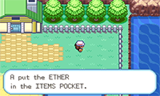

- Get the <PokeItem name="SS Ticket" />, then run back to Cerulean City and enter the Dig house.
- <PokeItem name="Ether" /> before <Pokemon name="Drowzee" /> / <Pokemon name="Raticate" /> if
  you need the <PokeMove name="Mega Kick" />s (not in Torrent).

## Cerulean City

- ### Rocket Grunt

  - <Pokemon name="Machop" />: <PokeMove name="Water Pulse" />
  - <Pokemon name="Drowzee" />: <PokeMove name="Mega Kick" />

    - <StateContext>
        {({ starter }) =>
          starter.spa >= 29 && (
            <>
              18.75% (3/16) to OHKO with <PokeMove name="Water Pulse" /> Torrent
            </>
          )
        }
      </StateContext>
    - <PokeDamage
        name="Headbutt"
        player={{ name: 'wartortle', level: 25, ev: 19 }}
        enemy={{ name: 'drowzee', level: 17, atk: 23 }}
      />
    - <PokeDamage
        name="Confusion"
        player={{ name: 'wartortle', level: 25, ev: 0 }}
        enemy={{ name: 'drowzee', level: 17, atk: 19 }}
      />

## Route 6

- Grab this hidden <PokeItem name="Rare Candy" /> and consider the <PokeItem name="Sitrus Berry" /> with low Sp. Def.

  
  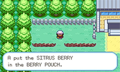

- Avoid the Bug Catcher and fight the Camper below the girl trainer.

- <StateContext>
    {({ starter: { hp }, frlg: { hikerExp } }) =>
      hikerExp === 'nob' && (
        <>
          
Before fighting Camper Jeff:

          <ul>
            <li>
              <PokeItem name="Rare Candy" /> to level 27 if you do not level out
              of torrent.
              <ul>
                <li>
                  <b>
                    +
                    {[3, 6, 10, 14, 18, 21, 22, 25, 26, 29].includes(hp)
                      ? '3'
                      : '2'}{' '}
                    HP
                  </b>{' '}
                  upon level up.
                </li>
              </ul>
            </li>
            <li>
              <PokeItem name="Ether" /> <PokeMove name="Mega Kick" /> if you
              have not already.
            </li>
            <li>
              Keep Torrent if you are still in it and will not die to a{' '}
              <PokeMove name="Quick Attack" />.
            </li>
          </ul>
        </>
      )
    }
  </StateContext>

- ### Camper Jeff

  - <Pokemon name="Spearow" />: <PokeMove name="Water Pulse" />
  - <Pokemon name="Raticate" />: <PokeMove
      name="Water Pulse"
      torrent={true}
    /> / <PokeMove name="Mega Kick" />

    - <PokeDamage
        name="Quick Attack"
        player={{ name: 'wartortle', level: 25, ev: 19 }}
        enemy={{ name: 'raticate', level: 16, atk: 30 }}
      />

## Vermilion City

- Head straight to the mart and buy

  - 5x <PokeItem name="Super Potion" /> (↓)
  - 3x <PokeItem name="Paralyze Heal" /> (↓↓)
  - 3x <PokeItem name="Repel" /> (↓↓↓)

- Head to the S.S. Anne.

## S.S. Anne

- <StateContext>
    {({ starter: { hp }, frlg: { hikerExp } }) =>
      hikerExp === 'eric' && (
        <>
          
Before fighting the rival:

          <ul>
            <li>
              <PokeItem name="Rare Candy" /> to level 27 if you do not level out
              of torrent.
              <ul>
                <li>
                  <b>
                    +
                    {[3, 6, 10, 14, 18, 21, 22, 25, 26, 29].includes(hp)
                      ? '3'
                      : '2'}{' '}
                    HP
                  </b>{' '}
                  upon level up.
                </li>
              </ul>
            </li>
            <li>
              <PokeItem name="Ether" /> <PokeMove name="Mega Kick" /> if you
              have not already.
            </li>
            <li>
              Keep Torrent if you are still in it and will not die to a{' '}
              <PokeMove name="Quick Attack" />.
            </li>
          </ul>
        </>
      )
    }
  </StateContext>

- ### Rival

  - <Pokemon name="Pidgeotto" />: <PokeMove
      name="Water Pulse"
      torrent={true}
    /> or <PokeMove name="Water Pulse" />, <PokeMove name="Bite" />

    - <PokeDamage
        name="Quick Attack"
        player={{ name: 'wartortle', level: 26, ev: 19 }}
        enemy={{ name: 'pidgeotto', level: 19, atk: 28 }}
        displayLevel={true}
        adjustEV={adjustEV('afterNob')}
      />
    - <PokeDamage
        name="Quick Attack"
        player={{ name: 'wartortle', level: 27, ev: 19 }}
        enemy={{ name: 'pidgeotto', level: 19, atk: 28 }}
        displayLevel={true}
        adjustEV={adjustEV('afterNob')}
      />

  - <StateContext>
      {({ starter: { nature, atk } }) => (
        <>
          <Pokemon name="Ivysaur" />:{' '}
          {(nature === 'modest' && atk <= 20) ||
          (nature !== 'modest' && atk <= 1) ? (
            <>
              <PokeMove name="Mega Kick" /> x2
            </>
          ) : (
            <>
              <PokeMove name="Bite" />, <PokeMove name="Mega Kick" />
            </>
          )}
        </>
      )}
    </StateContext>

    - <PokeDamage
        name="Vine Whip"
        player={{ name: 'wartortle', level: 26, ev: 1 }}
        enemy={{ name: 'ivysaur', level: 20, atk: 39 }}
        displayLevel={true}
      />
    - <PokeDamage
        name="Vine Whip"
        player={{ name: 'wartortle', level: 27, ev: 1 }}
        enemy={{ name: 'ivysaur', level: 20, atk: 39 }}
        displayLevel={true}
      />

  - <Pokemon name="Raticate" />: <PokeMove
      name="Water Pulse"
      torrent={true}
    /> / <PokeMove name="Mega Kick" />

    - <PokeDamage
        name="Quick Attack"
        player={{ name: 'wartortle', level: 26, ev: 19 }}
        enemy={{ name: 'raticate', level: 16, atk: 28 }}
        displayLevel={true}
        adjustEV={adjustEV('afterNob')}
      />
    - <PokeDamage
        name="Quick Attack"
        player={{ name: 'wartortle', level: 27, ev: 19 }}
        enemy={{ name: 'raticate', level: 16, atk: 28 }}
        displayLevel={true}
        adjustEV={adjustEV('afterNob')}
      />

  - <Pokemon name="Kadabra" />: <PokeMove name="Bite" />

    - <PokeDamage
        name="Confusion"
        player={{ name: 'wartortle', level: 26, ev: 2 }}
        enemy={{ name: 'kadabra', level: 18, atk: 49 }}
        displayLevel={true}
      />
    - <PokeDamage
        name="Confusion"
        player={{ name: 'wartortle', level: 27, ev: 2 }}
        enemy={{ name: 'kadabra', level: 18, atk: 49 }}
        displayLevel={true}
      />

- Talk to the captain for <PokeItem name="HM01" /> and take the Bed Lady's free heal on the way out.

## Vermilion City

- Press Select to teach <PokeMove name="Cut" /> to <Pokemon name="Rattata" /> / <Pokemon name="Sandshrew" />.
- <PokeMove name="Cut" /> the bush and enter the gym.
- Save after you find the first switch of the puzzle.

  - The second switch can be located to any adjacent can.
  - Soft reset if you did not get the second switch after saving.

- ### Gentlemen Tucker

  - <Pokemon name="Pikachu" />: <PokeMove name="Water Pulse" />
    <StateContext>
      {({ frlg }) => (
        <SpeedInfo
          range={
            frlg.mtMoonExp === 'josh'
              ? { from: 24, to: 26, at: 0 }
              : { from: 25, to: 27, at: 0 }
          }
        />
      )}
    </StateContext>

- ### Leader Surge

  - <Pokemon name="Voltorb" />: <PokeMove name="Water Pulse" /> (x2)
    <StateContext>
      {({ frlg }) => (
        <SpeedInfo
          range={
            frlg.mtMoonExp === 'josh'
              ? { from: 27, to: 30, at: 0 }
              : { from: 28, to: 31, at: 0 }
          }
        />
      )}
    </StateContext>

    - <StateContext>
        {({ starter: { spa } }) =>
          spa >= 28 && (
            <>{spa == 28 ? '62.5% (10/16)' : '81.25% (13/16)'} to OHKO</>
          )
        }
      </StateContext>

  - <Pokemon name="Pikachu" />: <PokeMove name="Water Pulse" />

  - <Pokemon name="Raichu" />: <PokeMove name="Water Pulse" />, <PokeMove
      name="Water Pulse"
      torrent={true}
    /> or <PokeMove name="Water Pulse" />, <PokeMove name="Mega Kick" />

    - <PokeDamage
        name="Shock Wave"
        player={{ name: 'wartortle', level: 28, ev: 2 }}
        enemy={{ name: 'raichu', level: 24, atk: 52 }}
      />
    - <PokeDamage
        name="Quick Attack"
        player={{ name: 'wartortle', level: 28, ev: 19 }}
        enemy={{ name: 'raichu', level: 24, atk: 43 }}
        adjustEV={adjustEV('afterNob')}
      />
    - <PokeDamage
        name="Quick Attack"
        player={{ name: 'wartortle', level: 28, ev: 19, stage: -2 }}
        enemy={{ name: 'raichu', level: 24, atk: 43 }}
        adjustEV={adjustEV('afterNob')}
      />

- Get the <PokeItem name="Bike Voucher" />, then run back to Cerulean City.

## Cerulean City

- Get the <PokeItem name="Bicycle" />, then register and use it.
- Head to the right towards Rock Tunnel.

## Route 9-10

- ### Jr. Trainer Alicia

  - <Pokemon name="Oddish" />: <PokeMove name="Mega Kick" />
  - <Pokemon name="Bellsprout" />: <PokeMove name="Bite" />
  - <Pokemon name="Oddish" />: <PokeMove name="Mega Kick" />
  - <Pokemon name="Bellsprout" />: <PokeMove name="Bite" />

- Run-into-bike manip the Hiker spinner (if you mess up just use bike from the bag).

- ### Bug Catcher Conner

  - <Pokemon name="Caterpie" />: <PokeMove name="Water Gun" />
  - <Pokemon name="Weedle" />: <PokeMove name="Water Gun" />
  - <Pokemon name="Venonat" />: <PokeMove name="Water Pulse" /> (x2)

    - <StateContext>
        {({ starter: { spa } }) =>
          spa >= 28 && (
            <>
              {spa <= 30 ? '37.5% (6/16)' : '43.75% (7/16)'} to OHKO without
              Torrent
            </>
          )
        }
      </StateContext>

- Grab these berries if short on <PokeItem name="Awakening" /> (<PokeItem name="Chesto Berry" />) or <PokeItem name="Paralyze Heal" /> (<PokeItem name="Cheri Berry" />).

  
  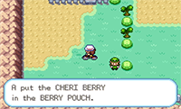

- Grab this hidden <PokeItem name="Rare Candy" /> after the Hiker (he has a vision range of 1 tile).

  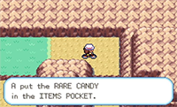

## Rock Tunnel

- Use <PokeItem name="Repel" /> as needed.
  - Use <PokeItem name="Elixir" /> on <PokeItem name="Repel" /> menu as necessary for <PokeMove name="Mega Kick" /> PP.
- Walk along the green path. Fight yellow trainers and **avoid red trainers**.

  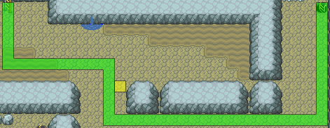

- ### Pokemaniac Ashton

  - <Pokemon name="Cubone" />: <PokeMove name="Water Gun" />
  - <Pokemon name="Slowpoke" />: <PokeMove name="Bite" /> (x2)

    - <StateContext>
        {({ starter: { spa } }) =>
          spa >= 28 && <>{spa <= 30 ? '12.5% (2/16)' : '25% (4/16)'} to OHKO</>
        }
      </StateContext>

- Walk along the green path. Fight yellow trainers and **avoid red trainers**.

  <StateContext>
    {({ frlg: { hikerExp } }) => (
      
    )}
  </StateContext>

- ### Pokemaniac Winston

  - <Pokemon name="Slowpoke" />: <PokeMove name="Bite" /> (x2)

    - <StateContext>
        {({ starter: { spa } }) =>
          spa >= 28 && (
            <>{spa <= 30 ? '6.25% (1/16)' : '18.75% (3/16)'} to OHKO</>
          )
        }
      </StateContext>

- ### Jr Trainer Martha

  - <StateContext>
      {({ starter: { nature, atk } }) => (
        <>
          <Pokemon name="Oddish" />:{' '}
          {nature === 'modest' || atk <= 15 ? (
            <>
              <PokeMove name="Bite" /> x2
            </>
          ) : (
            <>
              <PokeMove name="Mega Kick" />
            </>
          )}
        </>
      )}
    </StateContext>

    - <StateContext>
        {({ starter: { nature, atk } }) =>
          nature !== 'modest' &&
          atk >= 16 && (
            <>{atk <= 18 ? '81.25%' : atk <= 21 ? '87.5%' : '100%'} to OHKO</>
          )
        }
      </StateContext>

  - <Pokemon name="Bulbasaur" />: <PokeMove name="Mega Kick" />

    - <PokeDamage
        name="Razor Leaf"
        player={{ name: 'wartortle', level: 30, ev: 3 }}
        enemy={{ name: 'bulbasaur', level: 22, atk: 33 }}
      />

- <StateContext>
    {({ frlg: { hikerExp } }) =>
      hikerExp === 'eric' ? (
        <>
          <h3>Hiker Eric</h3>
          <ul>
            <li>
              <Pokemon name="Machop" />: <PokeMove name="Water Pulse" />
            </li>
            <li>
              <Pokemon name="Onix" />: <PokeMove name="Water Pulse" />
            </li>
          </ul>
        </>
      ) : (
        <>
          <h3>Hiker Allen</h3>
          <ul>
            <li>
              <Pokemon name="Geodude" />: <PokeMove name="Water Gun" />
            </li>
          </ul>
        </>
      )
    }
  </StateContext>

- Walk along the green path. Fight yellow trainers and **avoid red trainers**.

  

- ### Hiker Oliver

  - <Pokemon name="Onix" />: <PokeMove name="Bite" /> (x2)

    - 81.3% to OHKO

  - <Pokemon name="Onix" />: <PokeMove name="Water Gun" />
  - <Pokemon name="Geodude" />: <PokeMove name="Bite" />

- Walk along the green path. Fight yellow trainers and **avoid red trainers**.

  

- ### Jr Trainer Sofia

  - <Pokemon name="Jigglypuff" />: <PokeMove name="Water Pulse" />
  - <Pokemon name="Pidgey" />: <PokeMove name="Water Pulse" />
  - <Pokemon name="Meowth" />: <PokeMove name="Water Pulse" />

- ### Hiker Dudley

  - <Pokemon name="Geodude" />: <PokeMove name="Bite" />
  - <Pokemon name="Geodude" />: <PokeMove name="Bite" />
  - <Pokemon name="Graveler" />: <PokeMove name="Water Gun" />

- Run-into-**walk** manip the Supernerd ([Run-into-bike manip is slower due to lag from music transitions](https://www.youtube.com/watch?v=PwmYijBaFCU)).

- Walk along the green path. Fight yellow trainers and **avoid red trainers**.

  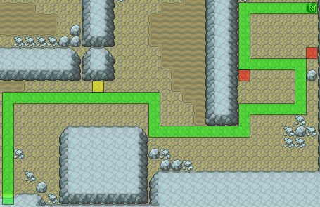

- ### Jr Trainer Dana

  - <Pokemon name="Meowth" />: <PokeMove name="Bite" />
  - <Pokemon name="Oddish" />: <PokeMove name="Mega Kick" />

    - Check how many Mega Kicks you have here.

  - <Pokemon name="Pidgey" />: <PokeMove name="Bite" />

## Lavender Town

- Head south to the mart and buy

  - 4x <PokeItem name="Escape Rope" /> (7x ↓)
  - 7x <PokeItem name="Super Repel" /> (↓)

- Head left to the next route.

## Route 8

- Fight the Gamer below.

  - ### Gamer Rich

    - <Pokemon name="Growlithe" />: <PokeMove name="Water Gun" />
    - <StateContext>
        {({ starter }) => (
          <>
            <Pokemon name="Vulpix" />:{' '}
            {starter.spa <= 29 ? (
              <PokeMove name="Water Pulse" />
            ) : (
              <PokeMove name="Water Gun" />
            )}
          </>
        )}
      </StateContext>

- Avoid all the trainers and head into the building above the bikers.

## Celadon City

- Head straight to the game corner.

- ## Rocket Grunt

  - <Pokemon name="Raticate" />: <PokeMove
      name="Water Pulse"
      torrent={true}
    /> / <PokeMove name="Mega Kick" />

    - <PokeDamage
        name="Quick Attack"
        player={{ name: 'wartortle', level: 32, ev: 28 }}
        enemy={{ name: 'raticate', level: 20, atk: 37 }}
      />

  - <Pokemon name="Zubat" />: <PokeMove name="Water Pulse" />
    <SpeedInfo range={{ from: 16, to: 18, at: -2 }} />

- Talk to the poster and head into the Rocket Hideout.

## Rocket Hideout

- Grab this <PokeItem name="Rare Candy" /> before going into the spinny tiles.

  

- Grab the <PokeItem name="Black Glasses" /> before heading downstairs.

  

- **Before** battling the lift key guy:

  - <PokeItem name="Rare Candy" /> to level 35.
  - Put your cursor on <PokeItem name="Escape Rope" />.

- ### Rocket Grunt (Lift Key Guy)

  - <Pokemon name="Koffing" />: <PokeMove name="Water Gun" torrent={true} /> / <PokeMove name="Water Pulse" />
  - <Pokemon name="Zubat" />: <PokeMove name="Water Gun" torrent={true} /> / <PokeMove name="Water Pulse" />

- Head towards the elevator to floor B4 and fight the left Rocket Grunt first.

- ### Rocket Grunt

  - <Pokemon name="Sandshrew" />: <PokeMove name="Bite" />
  - <Pokemon name="Sandslash" />: <PokeMove name="Water Pulse" />
  - <Pokemon name="Ekans" />: <PokeMove name="Water Pulse" />

    - <StateContext>
        {({ starter: { spa } }) =>
          spa >= 28 && spa <= 30 && '93.75% (15/16) to OHKO without Torrent'
        }
      </StateContext>

- ### Rocket Grunt

  - <Pokemon name="Ekans" />: <PokeMove name="Water Pulse" />
  - <Pokemon name="Sandshrew" />: <PokeMove name="Bite" />
  - <Pokemon name="Arbok" />: <PokeMove name="Water Pulse" torrent={true} /> or <PokeMove name="Bite" />
    , <PokeMove name="Water Pulse" />

    - Should get **+14** or **+15 HP** upon evolution.

- ### Giovanni

  - <Pokemon name="Onix" />: <PokeMove name="Water Gun" />
  - <Pokemon name="Rhyhorn" />: <PokeMove name="Water Gun" />
  - <Pokemon name="Kangaskhan" />: <PokeMove name="Water Pulse" /> x2-3

    - 98% to 2HKO with Torrent
    - <PokeDamage
        name="Mega Punch"
        player={{ name: 'blastoise', level: 36, ev: 35 }}
        enemy={{ name: 'kangaskhan', level: 29, atk: 68 }}
        adjustEV={adjustEV('afterEric')}
      />
    - <PokeDamage
        name="Mega Punch"
        player={{ name: 'blastoise', level: 36, ev: 35, stage: -1 }}
        enemy={{ name: 'kangaskhan', level: 29, atk: 68 }}
        adjustEV={adjustEV('afterEric')}
      />

- Grab the <PokeItem name="Silph Scope" /> and <PokeItem name="Escape Rope" /> out.

## Celadon City

- Bike straight to the mart and take the elevator to 5F (↓↓).
- Buy at the bottom vendor:
  - **If low on <PokeMove name="Mega Kick" /> or high HP after Giovanni**
    - <StateContext>
        {({ starter: { spe }, frlg: { mtMoonExp } }) => (
          <>
            {spe >= 30 || (spe >= 29 && mtMoonExp === 'josh') ? '4x' : '5x'}{' '}
            <PokeItem name="X Speed" /> (↓↓)
          </>
        )}
      </StateContext>
    - 21x <PokeItem name="X Sp Atk" text="X Special" /> (↓)
    - 4x <PokeItem name="X Accuracy" /> (↓)
    - 2x <PokeItem name="Guard Spec" /> (↓)
  - **If 2-3 PP for <PokeMove name="Mega Kick" /> left**
    - 1x <PokeItem name="X Attack" />
    - <StateContext>
        {({ starter: { spe }, frlg: { mtMoonExp } }) => (
          <>
            {spe >= 30 || (spe >= 29 && mtMoonExp === 'josh') ? '4x' : '5x'}{' '}
            <PokeItem name="X Speed" /> (↓↓)
          </>
        )}
      </StateContext>
    - 18x <PokeItem name="X Sp Atk" text="X Special" /> (↓)
    - 5x <PokeItem name="X Accuracy" /> (↓)
    - 3x <PokeItem name="Guard Spec" /> (↓)
- Take the elevator back down and bike west to get <PokeMove name="Fly" />.
- After obtaining <PokeMove name="Fly" />:
  - Teach <PokeMove name="Fly" /> to your bird.
  - Heal to around **44 HP**.
  - Use <PokeItem name="Super Repel" />.
  - Equip <PokeItem name="Black Glasses" />.
  - Toss <PokeItem name="Moon Stone" /> (makes for faster scrolling up and down in the menus).
  - <PokeMove name="Fly" /> to Lavender Town.

## Lavender Tower

- ### Rival

  - #### X Attack Strategy

    - <Pokemon name="Pidgeotto" />: <PokeItem name="Guard Spec" />, <PokeItem name="X Accuracy" />
      , <PokeItem name="X Attack" />, <PokeMove
        name="Water Pulse"
        torrent={true}
      /> / <PokeMove name="Mega Kick" />

      - <PokeDamage
          name="Quick Attack"
          player={{ name: 'blastoise', level: 36, ev: 35 }}
          enemy={{ name: 'pidgeotto', level: 25, atk: 38 }}
        />

    - <Pokemon name="Ivysaur" />: <PokeMove name="Mega Kick" />

      - <PokeDamage
          name="Razor Leaf"
          player={{ name: 'blastoise', level: 36, ev: 3 }}
          enemy={{ name: 'ivysaur', level: 25, atk: 48 }}
        />
      - <PokeDamage
          name="Razor Leaf"
          player={{ name: 'blastoise', level: 36, ev: 3 }}
          enemy={{ name: 'ivysaur', level: 25, atk: 48, torrent: true }}
        />

    - <Pokemon name="Gyarados" />: <PokeMove name="Mega Kick" />

      - Stall a turn if no Torrent.
      - <PokeDamage
          name="Thrash"
          player={{ name: 'blastoise', level: 37, ev: 35 }}
          enemy={{ name: 'gyarados', level: 23, atk: 65 }}
        />

    - <Pokemon name="Growlithe" />: <PokeMove name="Mega Kick" /> / <PokeMove name="Water Pulse" />
    - <Pokemon name="Kadabra" />: <PokeMove name="Water Pulse" />

  - #### X Special Strategy

    - <Pokemon name="Pidgeotto" />: <PokeItem
        name="X Sp Atk"
        text="X Special"
      /> x2, <PokeMove name="Bite" />

      - Only use one <PokeItem name="X Sp Atk" text="X Special" /> if in high enough HP
        to tank a Overgrow <PokeMove name="Razor Leaf" /> and <PokeMove name="Thrash" />.
      - Use an <PokeItem name="X Accuracy" /> if you get hit by <PokeMove name="Sand Attack"/> (Yolo if you get hit by it twice).
      - <PokeDamage
          name="Quick Attack"
          player={{ name: 'blastoise', level: 36, ev: 35 }}
          enemy={{ name: 'pidgeotto', level: 25, atk: 38 }}
        />

    - <Pokemon name="Ivysaur" />: <PokeMove
        name="Water Pulse"
        torrent={true}
      /> / <PokeMove name="Bite " /> x2

      - <StateContext>
          {({ starter: { spa } }) =>
            spa >= 28 && (
              <>
                <PokeMove name="Water Pulse" /> with Torrent is{' '}
                {spa <= 29 ? '68.75% (11/16)' : '81.25% (13/16)'} to OHKO at +2.
              </>
            )
          }
        </StateContext>
      - <StateContext>
          {({ starter: { spa } }) =>
            spa >= 28 && (
              <>
                <PokeMove name="Bite" /> is{' '}
                {spa <= 29 ? '62.5% (10/16)' : '68.75% (11/16)'} to OHKO at +2.
              </>
            )
          }
        </StateContext>

      - <PokeDamage
          name="Razor Leaf"
          player={{ name: 'blastoise', level: 36, ev: 3 }}
          enemy={{ name: 'ivysaur', level: 25, atk: 48 }}
        />
      - <PokeDamage
          name="Razor Leaf"
          player={{ name: 'blastoise', level: 36, ev: 3 }}
          enemy={{ name: 'ivysaur', level: 25, atk: 48, torrent: true }}
        />

    - <Pokemon name="Gyarados" />: <PokeMove name="Bite" /> x2

      - Stall a turn if no Torrent.
      - <PokeDamage
          name="Thrash"
          player={{ name: 'blastoise', level: 37, ev: 35 }}
          enemy={{ name: 'gyarados', level: 23, atk: 65 }}
        />

    - <Pokemon name="Growlithe" />: <PokeMove name="Bite" />
    - <Pokemon name="Kadabra" />: <PokeMove name="Water Gun" />

- Head to the 5th floor avoiding all optional trainers along the way.
  Do **not** grab any items till the 6th floor or use the healing pad.

- ### Channeler Tammy

  - <Pokemon name="Haunter" />: <PokeMove name="Water Gun" torrent={true} /> / <PokeMove name="Water Pulse" />

- ### Channeler Jennifer

  - <Pokemon name="Gastly" />: <PokeMove name="Water Gun" />

- ### Channeler Emilia

  - <Pokemon name="Gastly" />: <PokeMove name="Water Gun" />

- Grab this <PokeItem name="Rare Candy" /> before fighting <Pokemon name="Marowak"/>.

  

- ### Ghost Marowak

  - <Pokemon name="Marowak" />: <PokeMove name="Water Pulse" torrent={true} />

    - <PokeMove name="Mega Kick" /> / <PokeMove name="Bite" /> for one turn if not
      in Torrent.
    - <PokeDamage
        name="Bonemerang"
        player={{ name: 'blastoise', level: 36, ev: 35 }}
        enemy={{ name: 'marowak', level: 30, atk: 62 }}
        adjustEV={adjustEV('afterEric')}
      />

- Head upstairs and let every Rocket Grunt walk up to you along the way.

- ### Rocket Grunt

  - <Pokemon name="Zubat" />: <PokeMove name="Water Gun" torrent={true} />
  - <Pokemon name="Zubat" />: <PokeMove name="Water Gun" torrent={true} />
  - <Pokemon name="Golbat" />: <PokeMove name="Water Pulse" torrent={true} />

    - <StateContext>
        {({ starter: { spa } }) =>
          spa >= 28 && (
            <>
              {spa <= 30 ? '37.5% (6/16)' : '50% (8/16)'} to OHKO without
              Torrent.
            </>
          )
        }
      </StateContext>
    - If you need damage it is 1/4 to get a damaging move.

- ### Rocket Grunt

  - <Pokemon name="Koffing" />: <PokeMove name="Water Gun" torrent={true} />
  - <Pokemon name="Drowzee" />: <PokeMove
      name="Water Pulse"
      torrent={true}
    /> / <PokeMove name="Bite" />

- ### Rocket Grunt

  - <Pokemon name="Zubat" />: <PokeMove name="Water Gun" torrent={true} />
  - <Pokemon name="Zubat" />: <PokeMove name="Water Gun" torrent={true} />
  - <Pokemon name="Rattata" />: <PokeMove name="Water Gun" torrent={true} />
  - <Pokemon name="Raticate" />: <PokeMove name="Water Gun" torrent={true} /> / <PokeMove name="Water Pulse" />

    - <PokeDamage
        name="Quick Attack"
        player={{ name: 'blastoise', level: 38, ev: 38 }}
        enemy={{ name: 'raticate', level: 23, atk: 46 }}
      />

- Talk to the old man to exit, then fly to Celadon City after getting the <PokeItem name="Poke Flute" />.

## Celadon City

- Grab the <PokeItem name="Tea" /> from the old lady in the Celadon Mansion.
- Wake the <Pokemon name="Snorlax" /> and run away.
- Enter the cycling road.

## Cycling Road

- Bag manip the spinners at the beginning.
- Grab this hidden <PokeItem name="Rare Candy" /> (3rd sign down) and this hidden <PokeItem name="Max Elixir" />.

   

## Fuchsia City

- Head straight to the Safari Zone.

## Safari Zone

- Before the grass in the second area
  - <PokeItem name="Rare Candy" /> to level 41.
  - Use <PokeItem name="Super Repel" />.
- Grab this <PokeItem name="Full Restore" />.

  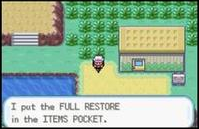

- Grab the <PokeItem name="Gold Teeth" /> and get <PokeItem name="HM03" /> from the guy in the house.

- Can grab this hidden <PokeItem name="Revive" /> for safety.

  

- <PokeMove name="Fly" /> to Fuchsia City and head to the gym.

## Fuchsia Gym

- The 1st and 3rd trainer in this gym are spinners, fight the 2nd guy.
- During the bag manip on the 1st spinner:

  - Teach <PokeMove name="Surf" /> over <PokeMove name="Water Gun" /> (Slot 1).

- ### Juggler Kirk
  - <Pokemon name="Drowzee" />: <PokeMove name="Surf" torrent={true} /> or <PokeItem
      name="X Sp Atk"
      text="X Special"
    />, <PokeMove name="Surf" />
  - <Pokemon name="Drowzee" />: <PokeMove name="Surf" />
  - <Pokemon name="Kadabra" />: <PokeMove name="Surf" />
  - <Pokemon name="Drowzee" />: <PokeMove name="Surf" />
- Heal out of Weezing/Muk kill range on the 2nd spinner.

- ### Leader Koga

  - <Pokemon name="Koffing" />: <PokeMove name="Surf" />
  - <Pokemon name="Muk" />: <PokeMove name="Surf" torrent={true} />, (<PokeItem
      name="X Sp Atk"
      text="X Special"
    />
    ), <PokeMove name="Surf" torrent={true} />

    - Use <PokeItem name="X Sp Atk" text="X Special" /> if **60+ HP** or if in <Pokemon name="Weezing" /> kill range after level up.
    - <PokeDamage
        name="Sludge"
        player={{ name: 'blastoise', level: 41, ev: 39 }}
        enemy={{ name: 'muk', level: 39, atk: 77 }}
      />

  - <Pokemon name="Koffing" />: <PokeMove name="Surf" />
  - <Pokemon name="Weezing" />: <PokeMove name="Surf" torrent={true} /> (at +1)
    / <PokeMove name="Water Pulse" />, <PokeMove name="Surf" />

    - <StateContext>
        {({ starter }) => starter.spa >= 30 && '68.75% to OHKO'}
      </StateContext>

    - <PokeDamage
        name="Sludge"
        player={{ name: 'blastoise', level: 42, ev: 40 }}
        enemy={{ name: 'weezing', level: 43, atk: 82 }}
        adjustEV={adjustEV('afterEric')}
      />

## Fuchsia City

- Grab <PokeMove name="Strength" /> from the warden.
- Once outside:
  - Use <PokeItem name="Super Repel" />.
  - Heal out of <Pokemon name="Growlithe" /> kill range if necessary.
  - <PokeMove name="Fly" /> to Pallet Town and <PokeMove name="Surf" /> south to
    Cinnabar Island.

## Cinnabar Island

- Go to the mansion (approach from the left side).

- <StateContext>
    {({ starter, frlg }) => {
      const carbosFor = grabCarbosFor(starter, frlg.mtMoonExp);
      return (
        <>
          {carbosFor ? 'Grab' : 'Skip'} the <PokeItem name="Carbos" />
          {carbosFor && carbosFor === 'blaine' ? (
            <>
              {' '}
              for Blaine's <Pokemon name="Rapidash" />
            </>
          ) : carbosFor === 'sabrina' ? (
            <>
              {' '}
              for Sabrina's <Pokemon name="Alakazam" />
            </>
          ) : carbosFor === 'giovanni' ? (
            <>
              {' '}
              for Giovannis's <Pokemon name="Dugtrio" />
            </>
          ) : (
            <></>
          )}.
        </>
      );
    }}
  </StateContext>

  - <StateContext>
      {({ starter }) =>
        starter.spe == 31 && (
          <>
            <b>Skip</b> it if you fought two <Pokemon name="Pidgey" /> /{' '}
            <Pokemon name="Rattata" /> on Route 1.
          </>
        )
      }
    </StateContext>

  

- Grab this hidden <PokeItem name="Elixir" /> and <PokeItem name="TM14" /> before grabbing the <PokeItem name="Secret Key" /> on the table.

  
  

- Before exiting the mansion:

  - Teach <PokeMove name="Strength" /> to <Pokemon name="Sandshrew" /> if you caught one.
  - Teach <PokeMove name="Blizzard" /> over <PokeMove name="Mega Kick" /> (Slot 4).
  - <StateContext>
      {({ starter, frlg }) =>
        grabCarbosFor(starter, frlg.mtMoonExp) === 'blaine' && (
          <>
            Use <PokeItem name="Carbos" /> now.
          </>
        )
      }
    </StateContext>
  - Use <PokeItem name="Escape Rope" /> and bike to the gym.

## Cinnabar Gym

- Puzzle answers are **A, B, B, B, A, B**.

- ### Leader Blaine

  - <StateContext>
      {({ starter, frlg: { mtMoonExp } }) => (
        <>
          <Pokemon name="Growlithe" />:{' '}
          {(starter.spe == 21 ||
            (grabCarbosFor(starter, mtMoonExp) === 'blaine' &&
              mtMoonExp === 'josh')) && (
            <>
              <PokeItem name="X Speed" />,{' '}
            </>
          )}
          (<PokeItem name="X Sp Atk" text="X Special" />
          ), <PokeMove name="Surf" /> /{' '}
          <PokeMove name="Water Pulse" torrent={true} />
        </>
      )}
    </StateContext>

    - Use <PokeItem name="X Sp Atk" text="X Special" /> if no Torrent for <Pokemon name="Arcanine" />.
    - Use <PokeMove name="Water Pulse" /> only if low PP on <PokeMove name="Surf" />.
    - <PokeDamage
        name="Take Down"
        player={{ name: 'blastoise', level: 42, ev: 42, defBadge: true }}
        enemy={{ name: 'growlithe', level: 42, atk: 63 }}
      />
    - <PokeDamage
        name="Fire Blast"
        player={{ name: 'blastoise', level: 42, ev: 8 }}
        enemy={{ name: 'growlithe', level: 42, atk: 63 }}
      />

  - <Pokemon name="Ponyta" />: <PokeMove name="Surf" /> <SpeedInfo range={{ from: 22, to: 23, at: 0 }} />
  - <Pokemon name="Rapidash" />: <PokeMove name="Surf" />

    - <PokeDamage
        name="Bounce"
        player={{ name: 'blastoise', level: 42, ev: 42, defBadge: true }}
        enemy={{ name: 'rapidash', level: 42, atk: 80 }}
      />
    - <PokeDamage
        name="Fire Blast"
        player={{ name: 'blastoise', level: 42, ev: 8 }}
        enemy={{ name: 'rapidash', level: 42, atk: 72 }}
      />

  - <Pokemon name="Arcanine" />: <PokeMove name="Surf" torrent={true} />

- Exit the gym and say **no** to Bill.
- <PokeMove name="Fly" /> to Celadon City and bike to the gym.

## Celadon Gym

- Head through the left side of the gym.

- ### Beauty Tamia

  - <Pokemon name="Bellsprout" />: <PokeMove name="Bite" />
  - <Pokemon name="Bellsprout" />: <PokeMove name="Bite" />

- ### Beauty Lori

  - <Pokemon name="Exeggcute" />: <PokeMove name="Bite" />

- ### Leader Erika

  - <Pokemon name="Victreebel" />: <PokeMove name="Surf" torrent={true} /> / <PokeMove name="Blizzard" />
  - <Pokemon name="Tangela" />: <PokeMove name="Bite" />
  - <Pokemon name="Vileplume" />: <PokeMove name="Blizzard" />

    - <PokeDamage
        name="Giga Drain"
        player={{ name: 'blastoise', level: 44, ev: 8, defBadge: true }}
        enemy={{ name: 'vileplume', level: 29, atk: 63 }}
      />

- Exit through the already cut bush, then <PokeMove name="Fly" /> to Celadon City and bike to Silph Co.

## Silph Co.

- Take the stairs to 5F.
- Always bag manip the Rocket Spinner. Can Bag Manip the Scientist walker if need be.
- On spinner bag manip:

  - Use <PokeItem name="Max Elixir" />.
  - <StateContext>
      {({ starter, frlg: { mtMoonExp } }) =>
        (grabCarbosFor(starter, mtMoonExp) === 'sabrina' ||
          grabCarbosFor(starter, mtMoonExp) === 'giovanni') && (
          <>
            Use <PokeItem name="Carbos" /> now.
          </>
        )
      }
    </StateContext>
  - <StateContext>
      {({ starter }) => (
        <>
          Heal to around <b>{silphRivalHP(starter)} HP</b>.
        </>
      )}
    </StateContext>

- ### Rival

  - <Pokemon name="Pidgeot" />: <PokeItem
      name="X Sp Atk"
      text="X Special"
    /> (x2), <PokeItem name="X Accuracy" />, <PokeMove name="Surf" />

    - Use 2x <PokeItem name="X Sp Atk" text="X Special" /> if <PokeMove name="Feather Dance" /> turn 1.
    - <PokeDamage
        name="Wing Attack"
        player={{ name: 'blastoise', level: 44, ev: 44, defBadge: true }}
        enemy={{ name: 'pidgeot', level: 37, atk: 68 }}
      />
    - <PokeDamage
        name="Quick Attack"
        player={{ name: 'blastoise', level: 44, ev: 44, defBadge: true }}
        enemy={{ name: 'pidgeot', level: 37, atk: 68 }}
      />

  - <Pokemon name="Venusaur" />: <PokeMove name="Blizzard" />
  - <Pokemon name="Gyarados" />: <PokeMove name="Blizzard" />, <PokeMove name="Bite" />

    - 68.75% (11/16) to OHKO at +2

  - <Pokemon name="Growlithe" />: <PokeMove name="Bite" />
  - <Pokemon name="Alakazam" />: <PokeMove
      name="Water Pulse"
      torrent={true}
    /> / <PokeMove name="Surf" />

- ### Rocket Grunt

  - <Pokemon name="Cubone" />: <PokeMove name="Bite" /> / <PokeMove name="Water Pulse" />

    - <StateContext>
        {({ starter: { spa } }) =>
          spa >= 28 && (
            <>{spa <= 29 ? '75% (12/16)' : '81.25% (13/16)'} to OHKO</>
          )
        }
      </StateContext>

  - <Pokemon name="Marowak" />: <PokeMove name="Water Pulse" />
  - <Pokemon name="Drowzee" />: <PokeMove name="Water Pulse" torrent={true} />

- ### Giovanni

  - <Pokemon name="Nidorino" />: <PokeMove name="Surf" torrent={true} />
  - <Pokemon name="Nidoqueen" />: <PokeMove name="Surf" torrent={true} />
  - <Pokemon name="Kangaskhan" />: <PokeMove name="Surf" torrent={true} />

    - <StateContext>
        {({ starter: { spa } }) =>
          spa >= 28 && (
            <>{spa <= 29 ? '68.75% (11/16)' : '81.25% (13/16)'} to OHKO</>
          )
        }
      </StateContext>
    - <PokeDamage
        name="Fake Out"
        player={{ name: 'blastoise', level: 46, ev: 47, defBadge: true }}
        enemy={{ name: 'kangaskhan', level: 35, atk: 82 }}
      />
    - <PokeDamage
        name="Mega Punch"
        player={{ name: 'blastoise', level: 46, ev: 47, defBadge: true }}
        enemy={{ name: 'kangaskhan', level: 35, atk: 82 }}
      />

  - <Pokemon name="Rhyhorn" />: <PokeMove name="Water Pulse" />

- <PokeItem name="Escape Rope" /> out and bike to the gym.

## Safron Gym

- Tile puzzle is **Top Left, Bottom Left, Down**.

- ### Leader Sabrina

  - <Pokemon name="Kadabra" />: <PokeMove name="Surf" torrent={true} />
  - <Pokemon name="Mr Mime" />: <PokeMove name="Surf" torrent={true} />

  - <StateContext>
      {({ starter, frlg }) => (
        <>
          <Pokemon name="Venomoth" />:{' '}
          {!(starter.spe >= 29 && grabCarbosFor(starter, frlg.mtMoonExp)) && (
            <>
              <PokeItem name="X Speed" />,{' '}
            </>
          )}
          <PokeMove name="Surf" torrent={true} />
        </>
      )}
    </StateContext>

    - <PokeDamage
        name="Psybeam"
        player={{ name: 'blastoise', level: 47, ev: 12, defBadge: true }}
        enemy={{ name: 'venomoth', level: 38, atk: 65 }}
      />

  - <Pokemon name="Alakazam" />: <PokeMove name="Surf" torrent={true} />

- <PokeItem name="Escape Rope" /> out, then <PokeMove name="Fly" /> to Viridian City
  and bike to the gym.

## Viridian Gym

- Take the spinny tile on the right.

- ### Blackbelt Takashi

  - <Pokemon name="Machoke" />: <PokeMove name="Surf" />

    - <StateContext>
        {({ starter: { spa } }) =>
          spa >= 28 && (
            <>
              {spa <= 29 ? '81.25% (13/16)' : '87.5% (14/16)'} to OHKO without
              Torrent
            </>
          )
        }
      </StateContext>

  - <Pokemon name="Machop" />: <PokeMove name="Surf" />
  - <Pokemon name="Machoke" />: <PokeMove name="Surf" />

- ### Cooltrainer Warren

  - <Pokemon name="Marowak" />: <PokeMove name="Water Pulse" torrent={true} />
  - <Pokemon name="Marowak" />: <PokeMove name="Water Pulse" torrent={true} />
  - <Pokemon name="Rhyhorn" />: <PokeMove name="Water Pulse" torrent={true} />
  - <Pokemon name="Nidorina" />: <PokeMove
      name="Water Pulse"
      torrent={true}
    /> / <PokeMove name="Surf" />
  - <Pokemon name="Nidoqueen" />: <PokeMove
      name="Water Pulse"
      torrent={true}
    /> / <PokeMove name="Surf" />

- ### Giovanni

  - <Pokemon name="Rhyhorn" />: <PokeMove name="Water Pulse" />

    - If less than 5 PP on <PokeMove name="Surf" />, you can <PokeMove name="Water Pulse" /> everything in Torrent.

  - <Pokemon name="Dugtrio" />: <PokeMove name="Water Pulse" />
    <StateContext>
      {({ starter, frlg }) =>
        grabCarbosFor(starter, frlg.mtMoonExp) !== 'giovanni' && (
          <SpeedInfo range={{ from: 18, to: 20, at: 0 }} />
        )
      }
    </StateContext>
  - <Pokemon name="Nidoking" />: <PokeMove name="Surf" /> / <PokeMove name="Water Pulse" torrent={true} />
  - <Pokemon name="Nidoqueen" />: <PokeMove name="Surf" /> / <PokeMove name="Water Pulse" torrent={true} />
  - <Pokemon name="Rhyhorn" />: <PokeMove name="Surf" /> / <PokeMove name="Water Pulse" />

    - <PokeMove name="Water Pulse" /> if only 3 <PokeMove name="Surf" /> PP left.

- After exiting, bike to Route 22.

## Route 22

- Use <PokeItem name="Full Restore" /> before fighting the rival.
- ### Rival

  - <Pokemon name="Pidgeot" />: <PokeItem
      name="X Sp Atk"
      text="X Special"
    /> x2, <PokeItem name="X Accuracy" />, <PokeMove name="Surf" />

    - Consider <PokeItem name="X Accuracy" /> skip if you can live a <PokeMove name="Razor Leaf" />.

  - <Pokemon name="Venusaur" />: <PokeMove name="Blizzard" />

    - <PokeDamage
        name="Razor Leaf"
        player={{ name: 'blastoise', level: 49, ev: 12, defBadge: true }}
        enemy={{ name: 'venusaur', level: 53, atk: 126 }}
      />

  - <Pokemon name="Rhyhorn" />: <PokeMove name="Bite" />
  - <Pokemon name="Gyarados" />: <PokeMove name="Bite" />, <PokeMove name="Blizzard" /> / <PokeMove name="Surf" />

    - If <Pokemon name="Gyarados" /> uses <PokeMove name="Rain Dance" /> you can <PokeMove name="Surf" /> instead
      of <PokeMove name="Blizzard" />.

  - <Pokemon name="Growlithe" />: <PokeItem name="X Speed" />, <PokeMove name="Bite" />

    - Skip <PokeItem name="X Speed" /> if <Pokemon name="Gyarados" /> used <PokeMove name="Rain Dance" /> and
      can tank a <PokeMove name="Psychic" />.

  - <Pokemon name="Alakazam" />: <PokeMove name="Surf" />

    - <PokeDamage
        name="Psychic"
        player={{ name: 'blastoise', level: 50, ev: 13, defBadge: true }}
        enemy={{ name: 'alakazam', level: 47, atk: 140 }}
      />

- Do not <PokeItem name="Super Repel" /> for the grass after Rival (1% chance to encounter).

## Victory Road

- As soon as you reach the water behind the 4th guard:
  - Use <PokeItem name="Super Repel" /> (keep up till Indigo Plateau).
  - Teach <PokeMove name="Strength" /> over <PokeMove name="Water Pulse" /> (Slot 2) if you do not have a <Pokemon name="Sandshrew" />.
- Avoid all trainers.

## Indigo Plateau

- Box heal and deposit HM slaves (from "Move" menu).
- Buy max <PokeItem name="Full Restore" /> (↓).

## Elite Four

- ### Lorelei

  - <Pokemon name="Dewgong" />: <PokeItem
      name="X Sp Atk"
      text="X Special"
    /> x4, <PokeMove name="Bite" />, <PokeMove name="Bite" />

    - <PokeMove name="Surf" /> if low roll from first <PokeMove name="Bite" />.
    - Check your <PokeItem name="X Speed" /> count here.

  - <Pokemon name="Cloyster" />: <PokeMove name="Bite" />
  - <Pokemon name="Slowbro" />: <PokeMove name="Bite" />
  - <Pokemon name="Jynx" />: <PokeMove name="Surf" />
    <SpeedInfo range={{ from: 15, to: 16, at: 0 }} />
  - <Pokemon name="Lapras" />: <PokeMove name="Bite" /> x3

    - <PokeDamage
        name="Body Slam"
        player={{ name: 'blastoise', level: 52, ev: 60, defBadge: true }}
        enemy={{ name: 'lapras', level: 54, atk: 113 }}
        adjustEV={adjustEV('afterEric')}
      />

- Heal to at least **80 HP** before Bruno.

  - <StateContext>
      {({ starter }) =>
        starter.spe == 31 ? (
          <>Do Mid HP Bruno strategy.</>
        ) : (
          <>
            Do High HP Bruno strategy if 1x <PokeMove name="Rock Tomb" /> and 2x{' '}
            <PokeMove name="Earthquake" /> puts you into high Torrent.
            <ul>
              <li>
                <b>
                  Need 3x <PokeItem name="X Speed" /> in your inventory for High
                  HP Bruno strategy.
                </b>
              </li>
            </ul>
          </>
        )
      }
    </StateContext>

- ### Bruno

  - #### High HP Strategy

    - <Pokemon name="Onix" />: <PokeItem
        name="X Sp Atk"
        text="X Special"
      /> x2, <PokeItem name="X Speed" />, <PokeMove name="Surf" /> / <PokeMove name="Bite" />

      - Use an extra <PokeItem name="X Sp Atk" text="X Special" /> if missed <PokeMove name="Rock Tomb" />.
      - <PokeMove name="Bite" /> both <Pokemon name="Onix" /> at +3 or more.
      - <PokeDamage
          name="Rock Tomb"
          player={{ name: 'blastoise', level: 52, ev: 60, defBadge: true }}
          enemy={{ name: 'onix', level: 51, atk: 66 }}
          adjustEV={adjustEV('afterEric')}
        />
      - <PokeDamage
          name="Earthquake"
          player={{ name: 'blastoise', level: 52, ev: 60, defBadge: true }}
          enemy={{ name: 'onix', level: 51, atk: 66 }}
          adjustEV={adjustEV('afterEric')}
        />

    - <Pokemon name="Hitmonchan" />: <PokeMove name="Surf" />

      - <PokeDamage
          name="Mach Punch"
          player={{ name: 'blastoise', level: 52, ev: 61, defBadge: true }}
          enemy={{ name: 'hitmonchan', level: 53, atk: 132 }}
          adjustEV={adjustEV('afterEric')}
        />
      - <PokeDamage
          name="Sky Uppercut"
          player={{ name: 'blastoise', level: 52, ev: 61, defBadge: true }}
          enemy={{ name: 'hitmonchan', level: 53, atk: 132 }}
          adjustEV={adjustEV('afterEric')}
        />
      - <PokeDamage
          name="Rock Tomb"
          player={{ name: 'blastoise', level: 52, ev: 61, defBadge: true }}
          enemy={{ name: 'hitmonchan', level: 53, atk: 132 }}
          adjustEV={adjustEV('afterEric')}
        />

    - <Pokemon name="Hitmonlee" />: <PokeMove name="Surf" />
    - <Pokemon name="Machamp" />: <PokeMove name="Surf" />
    - <Pokemon name="Onix" />: <PokeMove name="Surf" /> / <PokeMove name="Bite" />

  - #### Mid HP Strategy

    - <Pokemon name="Onix" />: <PokeItem name="Guard Spec" />, <PokeItem
        name="X Sp Atk"
        text="X Special"
      /> x2, <PokeMove name="Surf" /> / <PokeMove name="Bite" />

      - Continue setting up <PokeItem name="X Sp Atk" text="X Special" /> until +4 or at least +2 and in Torrent.
      - <PokeMove name="Bite" /> both <Pokemon name="Onix" /> at +3 or more.
      - <PokeDamage
          name="Rock Tomb"
          player={{ name: 'blastoise', level: 52, ev: 60, defBadge: true }}
          enemy={{ name: 'onix', level: 51, atk: 66 }}
          adjustEV={adjustEV('afterEric')}
        />
      - <PokeDamage
          name="Earthquake"
          player={{ name: 'blastoise', level: 52, ev: 60, defBadge: true }}
          enemy={{ name: 'onix', level: 51, atk: 66 }}
          adjustEV={adjustEV('afterEric')}
        />

    - <Pokemon name="Hitmonchan" />: <PokeMove name="Surf" />

      - <PokeDamage
          name="Mach Punch"
          player={{ name: 'blastoise', level: 52, ev: 61, defBadge: true }}
          enemy={{ name: 'hitmonchan', level: 53, atk: 132 }}
          adjustEV={adjustEV('afterEric')}
        />
      - <PokeDamage
          name="Sky Uppercut"
          player={{ name: 'blastoise', level: 52, ev: 61, defBadge: true }}
          enemy={{ name: 'hitmonchan', level: 53, atk: 132 }}
          adjustEV={adjustEV('afterEric')}
        />
      - <PokeDamage
          name="Rock Tomb"
          player={{ name: 'blastoise', level: 52, ev: 61, defBadge: true }}
          enemy={{ name: 'hitmonchan', level: 53, atk: 132 }}
          adjustEV={adjustEV('afterEric')}
        />

    - <Pokemon name="Hitmonlee" />: <PokeMove name="Surf" />
      <SpeedInfo range={{ from: 17, to: 18, at: 0 }} />

      - Can use <PokeItem name="Super Potion" /> here.

    - <Pokemon name="Machamp" />: <PokeMove name="Surf" />

      - Need at least +2 in torrent or +4 without Torrent to OHKO.

    - <Pokemon name="Onix" />: <PokeMove name="Surf" /> / <PokeMove name="Bite" />

- Heal to high Torrent before Agatha (usually <PokeItem name="Oran Berry" /> out of <PokeMove name="Shadow Punch"/> range).

- ### Agatha

  - <Pokemon name="Gengar" />: <PokeItem name="X Speed" />, <PokeItem
      name="X Sp Atk"
      text="X Special"
    />
    , <PokeMove name="Surf" torrent={true} />

    - Need at least +3 from here without Torrent.
    - <PokeDamage
        name="Shadow Punch"
        player={{ name: 'blastoise', level: 53, ev: 62, defBadge: true }}
        enemy={{ name: 'gengar', level: 54, atk: 100 }}
        adjustEV={adjustEV('afterEric')}
      />

  - <Pokemon name="Golbat" />: <PokeMove name="Surf" torrent={true} />
  - <Pokemon name="Arbok" />: <PokeMove name="Surf" torrent={true} />
  - <Pokemon name="Gengar" />: <PokeMove name="Surf" torrent={true} />
  - <Pokemon name="Haunter" />: <PokeMove name="Surf" torrent={true} />

- Heal to **full HP** before Lance.

- ### Lance

  - Consider risky strategy if 2x <PokeMove name="Dragon Rage" /> puts you into <PokeMove name="Hyper Beam" /> range.

  - #### Safe strategy

    - <Pokemon name="Gyarados" />: <PokeMove name="Bite" />, <PokeItem name="X Accuracy" />
      , <PokeItem name="X Sp Atk" text="X Special" />, <PokeMove name="Blizzard" />
      , <PokeMove name="Blizzard" />

      - <StateContext>
          {({ starter: { spa } }) =>
            spa >= 30 && <>{spa == 31 ? '41.8%' : '31.25% (5/16)'} to 2HKO</>
          }
        </StateContext>

      - <PokeDamage
          name="Hyper Beam"
          player={{ name: 'blastoise', level: 54, ev: 62, defBadge: true }}
          enemy={{ name: 'gyarados', level: 56, atk: 161 }}
        />

    - <Pokemon name="Dragonair" />: <PokeMove name="Blizzard" />

      - <PokeDamage
          name="Hyper Beam"
          player={{ name: 'blastoise', level: 54, ev: 62, defBadge: true }}
          enemy={{ name: 'dragonair', level: 54, atk: 111 }}
        />

    - <Pokemon name="Dragonair" />: <PokeMove name="Blizzard" />

      - <PokeDamage
          name="Hyper Beam"
          player={{ name: 'blastoise', level: 54, ev: 62, defBadge: true }}
          enemy={{ name: 'dragonair', level: 54, atk: 111 }}
        />

    - <Pokemon name="Dragonite" />: <PokeMove name="Blizzard" />
    - <Pokemon name="Aerodactyl" />: <PokeMove name="Surf" />

      - If <PokeMove name="Ancient Power" /> boost, heal and torrent <PokeMove name="Surf" />.
      - <PokeDamage
          name="Hyper Beam"
          player={{ name: 'blastoise', level: 55, ev: 62, defBadge: true }}
          enemy={{ name: 'aerodactyl', level: 58, atk: 129 }}
        />

  - #### Risky strategy

    - <Pokemon name="Gyarados" />: <PokeItem name="X Accuracy" />, <PokeItem
        name="X Sp Atk"
        text="X Special"
      />
      , <PokeMove name="Bite" /> x2, <PokeMove name="Blizzard" />

      - <StateContext>
          {({ starter: { spa } }) =>
            spa >= 28 && (
              <>
                {spa == 31 ? '85%' : '72%'} to 3HKO with{' '}
                <PokeMove name="Bite" /> x2, <PokeMove name="Blizzard" />{' '}
              </>
            )
          }
        </StateContext>
      - <StateContext>
          {({ starter: { spa } }) =>
            spa >= 29 && (
              <>
                {spa == 31 ? '83%' : '72%'} to 2HKO with{' '}
                <PokeMove name="Bite" /> Crit and <PokeMove name="Blizzard" />
              </>
            )
          }
        </StateContext>
      - <PokeDamage
          name="Hyper Beam"
          player={{ name: 'blastoise', level: 54, ev: 62, defBadge: true }}
          enemy={{ name: 'gyarados', level: 56, atk: 161 }}
        />

    - <Pokemon name="Dragonair" />: <PokeMove name="Blizzard" />

      - <PokeDamage
          name="Hyper Beam"
          player={{ name: 'blastoise', level: 54, ev: 62, defBadge: true }}
          enemy={{ name: 'dragonair', level: 54, atk: 111 }}
        />

    - <Pokemon name="Dragonair" />: <PokeMove name="Blizzard" />

      - Use <PokeItem name="Elixir" /> if you missed a <PokeMove name="Blizzard" />.
      - <PokeDamage
          name="Hyper Beam"
          player={{ name: 'blastoise', level: 54, ev: 62, defBadge: true }}
          enemy={{ name: 'dragonair', level: 54, atk: 111 }}
        />

    - <Pokemon name="Dragonite" />: <PokeMove name="Blizzard" />
    - <Pokemon name="Aerodactyl" />: <PokeMove name="Surf" />

      - If <PokeMove name="Ancient Power" /> boost, heal and torrent <PokeMove name="Surf" />.
      - <PokeDamage
          name="Hyper Beam"
          player={{ name: 'blastoise', level: 55, ev: 62, defBadge: true }}
          enemy={{ name: 'aerodactyl', level: 58, atk: 129 }}
        />

- Heal to **full HP** and use <PokeItem name="Elixir" /> before Champion.

- ### Champion

  - <Pokemon name="Pidgeot" />: <PokeItem name="Guard Spec" />, <PokeItem name="X Speed" />
    , <PokeItem name="X Sp Atk" text="X Special" /> x3, <PokeMove name="Surf" />

    - If you get into Torrent, skip the third <PokeItem name="X Sp Atk" text="X Special" /> and heal on <Pokemon name="Gyarados" />.
    - **Need** +3 without Torrent or +2 with Torrent to get past <Pokemon name="Alakazam" />.
    - Can <PokeMove name="Blizzard" /> at +2 if <PokeItem name="Guard Spec" /> runs out.
    - <PokeDamage
        name="Aerial Ace"
        player={{ name: 'blastoise', level: 55, ev: 62, defBadge: true }}
        enemy={{ name: 'pidgeot', level: 59, atk: 117 }}
      />

  - <Pokemon name="Venusaur" />: <PokeItem name="X Accuracy" />, <PokeMove name="Blizzard" />

    - Skip <PokeItem name="X Accuracy" /> if feeling risky.
    - <PokeMove name="Bite" /> and <PokeMove name="Surf" /> instead if +3 and in
      Torrent.

  - <Pokemon name="Alakazam" />: <PokeMove name="Surf" />
  - <Pokemon name="Rhydon" />: <PokeMove name="Surf" />
  - <Pokemon name="Gyarados" />: <PokeMove name="Bite" />, <PokeMove name="Blizzard" />

    - <PokeMove name="Blizzard" /> x2 if at +2.
    - <PokeDamage
        name="Thrash"
        player={{ name: 'blastoise', level: 56, ev: 64, defBadge: true }}
        enemy={{ name: 'gyarados', level: 59, atk: 153 }}
      />

  - <Pokemon name="Arcanine" />: <PokeMove name="Surf" />

    - <PokeDamage
        name="Extreme Speed"
        player={{ name: 'blastoise', level: 56, ev: 64, defBadge: true }}
        enemy={{ name: 'arcanine', level: 61, atk: 158 }}
      />

- Ending split is on fadeout after Hall of Fame.
